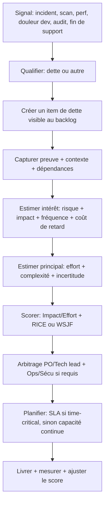
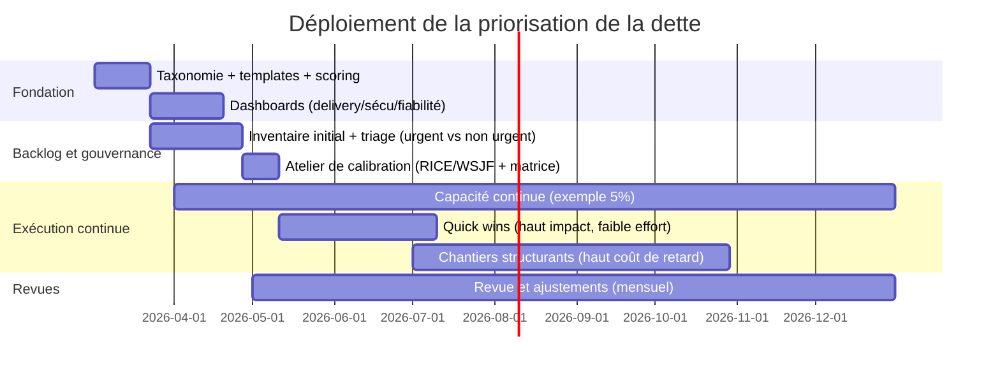

> ⚠️ À METTRE AU PROPRE 

La dette technique est une **métaphore financière** : on accélère la livraison aujourd’hui (le « prêt ») au prix d’un **surcoût futur** (les « intérêts ») qui se manifeste quand on doit modifier, stabiliser ou sécuriser le système. Cette façon de cadrer la discussion sert précisément à rendre visibles des coûts autrement diffus, maintenance, complexité, rework, ralentissement et à les mettre en balance avec les gains de vitesse à court terme.

Dans un contexte « budget + deadlines », la difficulté n’est pas de reconnaître que la dette existe, mais de **choisir rationnellement** ce qu’on rembourse *maintenant* (et ce qu’on accepte temporairement). La recherche montre que la priorisation de la dette demeure un domaine encore immature : il n’y a pas de consensus universel sur les facteurs « les plus importants », et les outils validés empiriquement sont limités. Autrement dit, on doit adopter une méthode **simple, explicable aux gestionnaires**, et qui s’améliore par itérations.

Le cœur d’une approche efficace est de rendre comparables, pour chaque item de dette, (1) le **principal** (effort de correction), (2) l’**intérêt** (coûts/risques encourus si on ne corrige pas), et (3) le **coût de retard** (ce que coûte le fait d’attendre dans le temps). Des cadres comme **impact/effort**, [Eisenhower](https://asana.com/fr/resources/eisenhower-matrix), [RICE](https://www.noe.pm/post/methode-rice-comment-prioriser-votre-produit), [WSJF](https://scrum-master.org/definition-du-wsjf-weighted-shortest-job-first/) et « Risk/Value » fournissent un vocabulaire commun et des mécanismes de triage qui se branchent bien sur les réalités de livraison.

Enfin, la dette se gère durablement comme une **hygiène de backlog** (visibilité, tags, définition de prêt, SLAs, reporting) et comme une **allocation continue de capacité** (même faible, exemple 5%) plutôt que par « grands sprints techniques » occasionnels. L’objectif est de réduire l’intérêt payé semaine après semaine, en mesurant des indicateurs concrets (DORA, vulnérabilités, incidents, vieillissement du backlog de dette).

## Dette technique : une définition opératoire

Une définition utile pour la priorisation doit être « comptable » : elle doit permettre d’estimer un coût et un impact. Selon [SonarSource](https://www.sonarsource.com/), la dette technique correspond aux **coûts futurs de reprise (rework) ou de maintenance** qui résultent du fait d’avoir privilégié la vitesse et des raccourcis à court terme, la dette s’accumulant dans le temps et nécessitant des ressources pour être remboursée.

La métaphore, introduite par [Ward Cunningham](https://en.wikipedia.org/wiki/Ward_Cunningham), est devenue centrale parce qu’elle explique aux parties prenantes non techniques pourquoi « livrer vite » peut coûter plus cher plus tard.

Pour rendre la dette actionnable, on la décompose en deux grandeurs :
- **Principal** : effort pour corriger (exemple : migration de dépendance, refactor, ajout de tests et simplification architecturale).
- **Intérêt** : surcoût payé tant qu’on ne corrige pas (exemple : temps de cycle plus long, incidents, risques de sécurité, frictions DevOps et complexité de changement).

La recherche souligne aussi que le concept de dette s’est élargi et peut se « diluer » (dette de tests, d’architecture, de documentation, etc.), ce qui crée un piège : confondre « dette » avec ce que les outils mesurent facilement (par exemple, seulement la dette de code) et ignorer la dette structurelle ou technologique (architecture, obsolescence).

Une revue systématique propose une taxonomie fréquemment utilisée en recherche : dette d’architecture, de design, de code, de tests, de build, de documentation, d’infrastructure, de versionnage, de requirements, et même « defect debt ». Cette diversité est précisément pourquoi une priorisation explicite est nécessaire.

## D’où vient la dette : pas seulement un choix volontaire

La dette technique n’est pas toujours « un raccourci assumé ». Martin Fowler propose un cadrage très utile à communiquer aux gestionnaires : distinguer la dette **délibérée vs involontaire**, et **prudente vs téméraire**. Même des équipes excellentes contractent parfois une dette « prudente-involontaire » : on apprend en construisant, et on réalise plus tard qu’un meilleur design était possible.

Sous contrainte d’échéancier, deux mécanismes créent fréquemment de la dette sans « mauvaise intention » :
- **Pression de livraison** : la qualité interne est repoussée (tests, hardening, refactor) pour respecter une date.
- **Dette « de connaissance »** : manque de compréhension technique ou de collaboration; on choisit une solution « qui marche » avant d’avoir compris l’ensemble des contraintes. 

Il existe aussi une dette **externe** (ou « liée aux dépendances ») : obsolescence technologique, changement d’environnement, arrivée de meilleures technologies, ou évolutions qui rendent « pas tout à fait correct » ce qui était acceptable auparavant.

Enfin, la dette est souvent **héritée** (legacy, acquisitions, rotation d’équipe). Les sources de terrain rappellent que limiter la dette à ce que les outils détectent conduit à ignorer des « gaps » architecturaux/technologiques typiquement présents dans du legacy.

Ce qui est important pour votre contexte (budget + deadlines) : une étude orientée « business-driven technical debt prioritization » montre que, du point de vue affaires, des facteurs comme la **fréquence d’usage**, la **perception de risque**, l’existence d’**incidents**, la **fréquence de livraison** et même la « flexibilité de négociation du temps » influencent directement la priorisation de dettes. Autrement dit, votre modèle doit parler explicitement le langage « risque + opérations + valeur métier ».

## Cadres et matrice de priorisation

### Clarifier la « matrice de Cynefin et l’aligner sur des variantes connues

**[Cynefin](https://fr.wikipedia.org/wiki/Cadre_conceptuel_Cynefin) n’est pas un outil de priorisation** (comme impact/effort). Cynefin sert d’abord à **qualifier la nature du problème**, puis à choisir l’approche de décision et d’exécution la plus adaptée.

En pratique, Cynefin est très utile pour la dette technique parce qu’il évite un piège fréquent : traiter toutes les dettes comme si elles étaient “simples” (une liste triée par score), alors que certaines dettes sont surtout des sujets d’exploration, de découverte et de réduction d’incertitude.

#### Les domaines Cynefin, appliqués à la dette technique

- **Clair (obvious)** : cause/effet évident, solutions connues.  
  Exemples : nettoyage local, mise à jour mineure, correction d’un anti-pattern connu.  
  Approche : standardiser, automatiser, faire vite (très compatible avec impact/effort).

- **Compliqué (complicated)** : cause/effet analysable, mais demande expertise.  
  Exemples : upgrade de dépendances majeures, refactor guidé par profiling, durcissement de sécurité avec exigences précises.  
  Approche : analyse d’experts, design ciblé, planification plus classique.

- **Complexe (complex)** : incertitude élevée, on comprend après coup.  
  Exemples : modernisation d’un legacy peu documenté, découplage de services fortement couplés, dette “structurelle” (architecture/organisation).  
  Approche : réduire le risque par **petites expériences** (spikes, prototypes, “strangler”, instrumentation), puis ré-estimer. Ici, la “confiance” (RICE) devient un signal central, et on priorise souvent un **plan de réduction d’incertitude** avant un gros remboursement.

- **Chaotique (chaotic)** : instabilité, urgence, pas de cause/effet fiable sur le moment.  
  Exemples : incident majeur prod, vulnérabilité exploitée, service en dégradation rapide.  
  Approche : stabiliser d’abord (activer le mode incident / gel des changements non essentiels), puis revenir vers une analyse plus structurée.

- **Désordre (disorder)** : on ne sait pas encore dans quel domaine on est.  
  Approche : décomposer le problème et le reclasser par morceaux (certaines parties seront claires, d’autres complexes).

#### Comment intégrer Cynefin à la priorisation (sans alourdir le processus)

Cynefin se place **avant** le scoring.

Un processus simple :

1) **Classifier** l’item (clair / compliqué / complexe / chaotique).  
2) **Adapter** la façon d’estimer :
   - clair/compliqué : estimation effort + scoring classique (impact/effort, WSJF, RICE).
   - complexe : ajouter une étape de réduction d’incertitude (spike, instrumentation, prototype) et **réviser** effort + confiance après.
   - chaotique : gérer via un canal “urgent” (incident/sécurité), puis rebasculer vers le backlog normal une fois stabilisé.
3) **Prioriser** avec ton cadre habituel (WSJF/RICE/impact-effort), mais avec des attentes réalistes sur la précision des estimations selon le domaine.

### Un guide pratique des cadres

**Matrice effort–impact (valeur–effort)**  
C’est votre « triage rapide ». Elle fonctionne très bien pour un portefeuille de dettes hétérogènes, surtout quand on veut des gains visibles sans exploser l’échéancier.
Adaptation dette technique : remplacez « impact » par **intérêt évité** (risques/temps/incidents réduits) et « effort » par **principal**.

**Eisenhower (urgent vs important)**  
Un outil de priorisation basé sur l'urgence et 'importance : on divise en quatre quadrants (« faire maintenant », « planifier », « déléguer », « éliminer »).
Adaptation dette : l’**urgence** devient « échéance/criticité temporelle » (fin de support, audit, faille exploitée), l’**importance** devient « impact risk/ops/business ».

**RICE (Reach, Impact, Confidence, Effort)**  
Proposé par [Intercom](https://www.intercom.com/), RICE force la discipline : on estime portée, impact, confiance et effort, puis on calcule un score.

Adaptation dette :  
- Reach : nombre de services/équipes impactés, nombre de users, volume de transactions touchées.  
- Impact : réduction de risque, baisse d’incidents, amélioration de performance.  
- Confidence : qualité de données (logs, scans, incident history).  
- Effort : estimation de correction.

**WSJF (Weighted Shortest Job First)**  
Formalisé par Scaled Agile, Inc. WSJF priorise le travail pour maximiser le bénéfice économique : **WSJF = coût de retard / durée (effort)**, et le coût de retard est composé de valeur business/user, criticité temporelle, réduction de risque/opportunity enablement, avec un principe clé : les priorités doivent être continuellement mises à jour. C’est particulièrement efficace pour la dette parce que la « réduction de risque » est une composante explicite.

**Risk/Value et « coût de retard vs valeur »**  
Le « coût de retard » (cost of delay) est défini comme le coût d’un délai dans la réalisation de valeur (revenus perdus, opportunités ratées, risques accrus, etc.). Pour la dette, c’est souvent le meilleur pont avec les gestionnaires : on ne vend pas un refactor « par principe », on justifie un remboursement parce que le **retard** coûte concrètement (incidents, risque sécurité, délai de livraison futur, coûts d’opération).

### Une procédure concrète pour prioriser la dette

Ci-dessous, un processus léger mais rigoureux (adapté à un texte court et à un public Dev/Tech lead/PO/Gestion).

**Étape de cadrage (essentielle)** : exiger une « preuve minimale » (logs, scan, incident, métrique, fin de support, plainte récurrente). Quand on manque de données, RICE force au moins un niveau de « confiance » explicitement faible, ce qui évite de surclasser des dettes « ressenties » vs « probantes ».

**Score d’intérêt recommandé (critères)** :  
- **Sécurité** : maturité patching/vuln, délais de remédiation, exceptions, conformité. Les lignes directrices canadiennes proposent des métriques explicites de vulnérabilités (patch time, mean time to remediate, exceptions) et soulignent l’usage de rapports/dashboards pour le suivi et la conformité. 
- **Fiabilité** : incidents et SLO miss. L’approche « error budget » formalise l’arbitrage : si le budget d’erreur est dépassé, on gèle les changements non critiques pour se concentrer sur fiabilité (et sécurité).
- **Fréquence d’usage / hotspots** : plus une zone est touchée, plus l’intérêt se paie souvent; c’est aussi un facteur observé côté business (usage frequency).
- **Coût de retard** : coût du délai en valeur/perte/risque.
- **Visibilité parties prenantes** : incidents visibles, risques réputationnels, audits (facteurs « risk perception » et « incidents » ressortent côté business).

**Exemple (format backlog/production, sans code)**  
Un service critique subit des incidents intermittents et une dépendance arrive en fin de support. La dette reçoit (a) un score élevé d’urgence (fin de support), (b) un score élevé de risque (incidents + exposition), (c) un effort moyen (upgrade + tests), donc elle se classe « faire maintenant » (Eisenhower) et « haut WSJF » (coût de retard élevé / durée moyenne).

## Gouvernance et hygiène de backlog

La dette devient ingérable lorsqu’elle est « hors backlog » (tickets dispersés, notes d’architecture, backlog caché). Dans le Guide Scrum, le Product Backlog est défini comme une **liste ordonnée et émergente** de ce qui est nécessaire pour améliorer le produit, et comme **l’unique source** du travail entrepris par l’équipe; et le Product Owner est redevable de l’ordre et de la transparence/visibilité/compréhension du backlog.

### Recommandations de backlog adaptées à la dette

**Format minimal d’un item de dette** (pour être priorisable) :  
- preuve (incident/scan/metric),  
- impact (intérêt) + coût de retard (même qualitatif),  
- effort (principal) + incertitude,  
- dépendances,  
- critères d’acceptation et mesure « avant/après ».  
Cela s’aligne sur l’idée d’affinement continu du backlog : décomposer et ajouter des détails (description, ordre, taille) jusqu’à un niveau de transparence suffisant.

**Tags recommandés** (exemples) : TD-SEC, TD-PERF, TD-REL (fiabilité), TD-ARCH, TD-TEST, TD-DEP (dépendances), TD-OBS (observabilité), TD-COMP (conformité), TD-LEGACY. Le but est d’obtenir des vues « risque vs roadmap » compréhensibles pour gestion/PO.

**SLAs (surtout sécurité)** :  
La gestion des correctifs et des vulnérabilités fournit un modèle robuste de SLA parce qu’elle formalise un cycle « évaluer → prioriser → déployer → valider », et qu’elle est explicitement présentée comme un levier de réduction de risque et d’évitement de compromis évitables.
Selon le [National Institute of Standards and Technology](https://www.nist.gov/), la gestion des correctifs en entreprise est le processus d’identifier, prioriser, acquérir, installer et vérifier l’installation de patches/updates/upgrades.

**Reporting (pour parties prenantes)** :  
- tableau de bord vulnérabilités (MTTR, patch time, exceptions),
- tableau de bord fiabilité (incidents, SLO, error budget),
- tableau de bord delivery (métriques DORA) avec une lecture « dette vs vitesse ».

### Modèle de template — item de dette technique

| Champ | Contenu attendu (court, vérifiable) |
|---|---|
| Titre | Verbe + actif + zone (exemple « Stabiliser retries du service Paiement ») |
| Type/Tag | TD-SEC / TD-PERF / TD-REL / etc. |
| Source du signal | Incident, scan, audit, métrique, fin de support |
| Preuve | Lien vers incident/scan/log/graph; 1–2 phrases de lecture |
| Intérêt (impact) | Sécurité, fiabilité, performance, maintenabilité, conformité |
| Coût de retard | Ce qui empire si on attend (risque accru, incidents, délais futurs) |
| Fréquence | Hotspot (touché souvent) vs zone froide |
| Principal (effort) | Estimation + incertitude + dépendances |
| AC (done) | Critères d’acceptation + mesure avant/après |
| SLA/Date cible | Si time-critical (sécu/compliance/fin support) |
| Visibilité | Qui doit être informé (PO, gestion, sécu/ops) |

### Modèle de template — matrice de priorisation

| Critère | Score (1–5) | Commentaire (preuve) |
|---|---:|---|
| Valeur/réduction d’intérêt |  | Incident évité, dette « hotspot », simplification |
| Réduction de risque |  | Vulnérabilité, exposition, conformité |
| Criticité temporelle |  | Fin support, audit, fenêtre de release |
| Fréquence d’usage |  | Touché souvent / impact prod visible |
| Confiance (RICE) | 0.5 / 0.8 / 1.0 | Qualité des données |
| Effort (principal) |  | Taille relative / dépendances |
| Score (exemple WSJF-like) | (Valeur+Risque+Temps)×Confiance / Effort | Comparable et explicable |

## Allocation continue de capacité et métriques

### Retour d’expérience synthétisé : « 5% de capacité » en contexte budget + deadlines

Dans plusieurs organisations contraintes par des échéanciers serrés, une stratégie pragmatique consiste à réserver une **petite enveloppe stable** (par exemple ~5% de capacité) dédiée à la dette « non urgente », en plus d’un canal séparé pour la dette **time‑critical** (sécurité, conformité, fin de support). Cette idée s’aligne avec des pratiques de gouvernance qui reconnaissent qu’on doit investir en continu pour éviter l’accumulation (plutôt que « tout payer à la fin »).

L’analogie la plus parlante pour gestion/PO est celle de l’entretien préventif : le patch management est présenté comme un processus répétable et standardisé qui génère des économies (réduction d’exposition, évitement de compromis). La dette technique se traite de façon semblable : une petite routine diminue les risques et protège la capacité future.

### Bénéfices typiques

- **Prévisibilité** : on sort du cycle « on repousse toujours la dette ».  
- **Réduction graduelle de l’intérêt** sur les hotspots (moins de rework, moins d’incidents).
- **Meilleure conversation avec les gestionnaires** via coût de retard (on décide en dollars/risque, pas en préférences techniques).

### Limites (importantes à annoncer)

5% peut être trop faible si la dette est déjà structurante (legacy lourd, obsolescence, incidents fréquents). La littérature insiste que la dette et sa priorisation dépendent fortement du contexte et qu’il n’existe pas de recette universelle; il faut donc calibrer la capacité (et possiblement monter temporairement) si les métriques de risque et de delivery se détériorent.

### Métriques pour mesurer l’efficacité

- **Delivery** via [DORA](https://www.atlassian.com/devops/frameworks/dora-metrics) : lead time, deployment frequency, change fail rate, temps de restauration, etc.
- **Sécurité** : MTTR vuln, patch time, exceptions; ces métriques sont explicitement proposées dans des lignes directrices canadiennes.
- **Fiabilité** : error budget et politiques de gel des changements non critiques quand le budget est consommé (mécanisme de gouvernance très « exécutable »).
- **Backlog dette** : âge médian des items, % items « high risk » hors SLA, ratio dette créée vs remboursée (à suivre mensuellement).

## Feuille de route sur un an et indicateurs clés

Cette feuille de route vise un déploiement réaliste sur environ six à douze mois, compatible avec un contexte budget/délais.

**Phase de mise en place (premiers mois)**  
Définir la taxonomie, les critères de scoring, et un template unique; puis rendre la dette visible et ordonnée dans le backlog (pas un backlog parallèle).

**Phase de stabilisation (milieu d’année)**  
Appliquer la matrice effort–impact pour des « victoires rapides », et utiliser RICE/WSJF pour les dettes qui nécessitent une argumentation économique (coût de retard).

**Phase d’industrialisation (fin d’année)**  
Mettre en place des SLAs sécurité/conformité et un reporting mensuel; relier les décisions de dette à des métriques de delivery, vulnérabilités et fiabilité (error budget).

**KPIs à suivre (mensuel, puis trimestriel)**  
- DORA (throughput + instability) pour objectiver l’effet de la dette sur la livraison. 
- Vulnérabilités (MTTR, patch time, exceptions) pour tenir la discussion « risque » avec les gestionnaires.
- Incidents/SLO/error budget pour arbitrer fiabilité vs features de façon transparente.
- Santé du backlog de dette (âge, volume, ratio remboursé/créé) pour éviter la dérive.

## Questions de calibration finales

1. Quel outil de backlog utilisez-vous (par exemple, Azure DevOps ou Jira), et avez-vous déjà des champs/labels normalisés pour sécurité, conformité et incidents ?  
2. Avez-vous des SLAs existants (internes ou contractuels) pour patching/vulnérabilités ou disponibilité, qui devraient automatiquement rendre certains items « urgents » ?  
3. Quelles données sont déjà disponibles (APM, logs, scans sécu, incidents) pour alimenter la variable « confiance » (RICE) et le coût de retard (WSJF) ?  
4. Votre principale douleur aujourd’hui est-elle la **lenteur de livraison**, les **incidents**, les **risques sécurité**, ou la **maintenabilité** (exemple : onboarding, changements risqués) — et laquelle est la plus visible côté gestion ?  
5. Combien d’équipes/services sont couplés (dépendances), et existe-t-il un « goulot » récurrent (exemple : équipe plateforme, sécurité, DBA) qui transforme certaines dettes en bloquants systémiques ?

## Conclusion

Dans un contexte contraint par les budgets et les échéanciers, la dette technique ne peut plus être abordée comme un problème purement technique ni comme une activité « quand on aura le temps ». Elle doit être traitée comme un **portefeuille de risques et d’investissements**, piloté avec la même rigueur que les initiatives métier. L’objectif n’est pas d’éliminer toute dette, ce qui serait irréaliste, mais de **choisir consciemment laquelle porter, laquelle rembourser et quand**.

Une priorisation efficace repose sur trois piliers complémentaires :

- **Rendre la dette visible et comparable**, en exprimant chaque item en termes de principal, d’intérêt et de coût de retard.
- **Utiliser des cadres de décision simples et explicables**, capables de traduire des préoccupations techniques en langage opérationnel et économique (risque, incidents, valeur, délai).
- **Instaurer une gestion continue**, intégrée au backlog et soutenue par une allocation de capacité récurrente, plutôt que des initiatives ponctuelles et tardives.

Avec cette approche, la dette cesse d’être un « passif invisible » et devient un levier de pilotage : on investit là où la réduction de risque et l’amélioration de la capacité de livraison sont les plus significatives. Les métriques de delivery, de sécurité et de fiabilité permettent alors de vérifier concrètement si les remboursements produisent l’effet attendu.

En définitive, prioriser la dette technique sous contrainte consiste moins à « faire du ménage » qu’à **préserver durablement la capacité d’évolution du système**. Une organisation qui maîtrise sa dette protège non seulement sa vitesse de livraison actuelle, mais surtout sa capacité à répondre aux besoins futurs sans explosion des coûts, des risques ou de la complexité.
