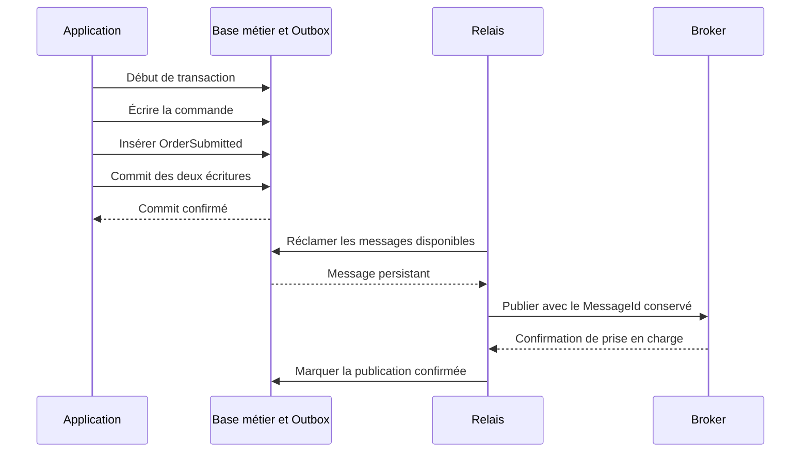
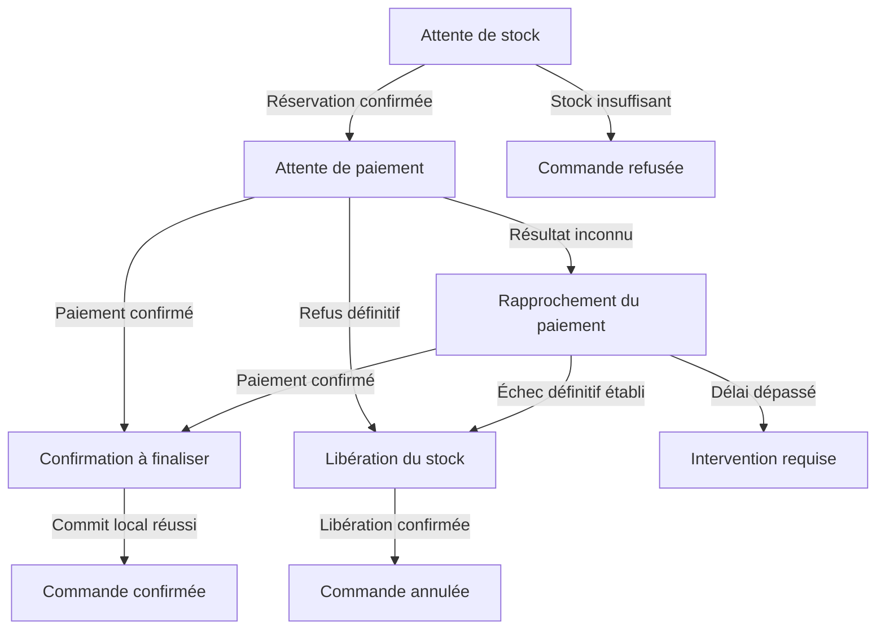

## Préambule

Une commande est enregistrée, mais le service de stock n’en reçoit jamais la notification. Un paiement est accepté, puis la connexion se coupe avant que l’application obtienne la réponse. Un message est livré une deuxième fois et déclenche une seconde opération métier.

Ces situations ont un point commun : une partie du système a progressé, tandis qu’une autre ignore encore ce qui s’est produit. Dès qu’une opération traverse plusieurs processus et stockages, une transaction locale ne suffit plus à protéger l’ensemble du parcours.

Saga et Transactional Outbox apportent des réponses complémentaires à ce problème. La première organise la progression et la récupération d’un processus métier distribué. La seconde protège le lien entre une modification locale et les messages qu’elle doit produire. L’idempotence, souvent appuyée par une Inbox, rend les reprises acceptables du côté des consommateurs.

Leur adoption change toutefois le modèle de fonctionnement de l’application. Il faut représenter les opérations en attente, décider quoi faire des résultats incertains et fournir des moyens de reprise. Comprendre ces conséquences est aussi important que choisir une bibliothèque ou un broker.

## 1. Définir ce qui doit rester cohérent

Prenons un parcours de commande réparti entre trois services : Commandes, Stock et Paiements. Chacun possède ses données. Le service Commandes ne peut donc pas valider une transaction SQL qui engloberait naturellement les modifications des deux autres.

Avant de choisir un patron, il faut préciser les invariants :

| Invariant du scénario | Conséquence de conception |
|---|---|
| Le stock disponible ne doit pas devenir négatif. | Le service Stock doit arbitrer les réservations concurrentes atomiquement. |
| Une même opération de paiement ne doit pas être exécutée deux fois. | Les reprises doivent conserver une identité d’opération stable. |
| Une commande ne doit être confirmée qu’avec un stock réservé et un paiement confirmé. | Le processus doit distinguer les résultats définitifs des étapes en attente. |
| Une commande abandonnée ne doit pas conserver indéfiniment sa réservation. | Une procédure de libération, d’expiration ou de rapprochement est nécessaire. |

Ces invariants ne demandent pas tous la même garantie. Le contrôle du stock peut rester strict dans une transaction locale. La mise à jour de l’affichage d’une commande peut, elle, tolérer un délai de propagation.

**La cohérence éventuelle doit s’accompagner d’un délai acceptable et d’une procédure pour les opérations qui dépassent ce délai.** Une réservation bloquée pendant trois jours n’est pas simplement une donnée « encore en cours de convergence » si le métier attend une réponse en quelques minutes.

Le contrat avec l’utilisateur compte également. Une réponse indiquant que la demande a été reçue ne doit pas être interprétée comme une confirmation de paiement ou de commande. Un état consultable, tel que `Pending`, `Confirmed` ou `RequiresReview`, permet de rendre cette distinction explicite.

## 2. La double écriture : une fenêtre de panne impossible à supprimer par l’ordre des appels

Supposons que Commandes enregistre une commande, puis publie `OrderSubmitted` vers un broker :

```csharp
await db.SaveChangesAsync(cancellationToken);
await publisher.PublishAsync(orderSubmitted, cancellationToken);
```

Si le processus tombe entre les deux appels, la commande existe, mais le processus distribué ne démarre jamais. Inverser les appels déplace le problème : le message peut être consommé alors que l’écriture métier échoue ensuite.

| Ordre des opérations | Échec possible | Conséquence |
|---|---|---|
| Base, puis broker | Arrêt après le commit et avant la publication. | État durable sans notification. |
| Broker, puis base de données | Échec de la transaction après publication. | Notification d’un changement qui n’a pas été validé. |
| Publication pendant une transaction SQL ouverte | Message accepté, puis rollback SQL. | Le broker conserve un message malgré l’annulation locale. |

Entourer les appels d’un `try/catch` permet de réagir à certaines erreurs. Cela ne permet pas d’exécuter du code de récupération après l’arrêt brutal du processus. Une reprise uniquement en mémoire présente la même limite.

Le transport ne détermine pas à lui seul la solution. Une chaîne HTTP peut rencontrer ce problème, tout comme une chaîne de messages. L’asynchronisme aide à découpler le rythme des composants, mais demande lui aussi une gestion explicite de la durabilité.

## 3. Transactional Outbox : rendre l’intention de publication durable

Le [Transactional Outbox](https://microservices.io/patterns/data/transactional-outbox.html) consiste à écrire l’état métier et le message à émettre dans la même transaction locale. Un relais lit ensuite les messages persistés et les transmet au broker.

La transaction protège donc deux écritures dans un même périmètre de stockage. Elle ne contient pas l’appel réseau au broker.



Si la transaction échoue, ni la commande ni son message ne sont validés. Si elle réussit, le message reste disponible pour une publication ultérieure, même après le redémarrage de l’application.

Cette garantie reste conditionnelle à l’exploitation du système : le stockage doit conserver le message, le relais doit reprendre et le broker doit redevenir accessible. Une Outbox abandonnée ou purgée trop tôt ne garantit aucune progression.

### Exemple local avec EF Core

Avec un fournisseur relationnel qui supporte les transactions, [EF Core rend les modifications d’un même `SaveChanges` transactionnelles](https://learn.microsoft.com/en-us/ef/core/saving/transactions). L’extrait suivant illustre cette frontière. Les entités `Order` et `OutboxMessage` sont des types applicatifs :

```csharp
// Identifiants établis pour cette opération logique.
// Le mécanisme de reprise doit les conserver.
var order = new Order
{
    Id = orderId,
    RequestId = requestId,
    Status = "Pending"
};

var integrationEvent = new
{
    OrderId = orderId,
    RequestId = requestId
};

db.Orders.Add(order);
db.OutboxMessages.Add(new OutboxMessage
{
    Id = messageId,
    Type = "orders.order-submitted.v1",
    AggregateId = orderId,
    OccurredOnUtc = DateTimeOffset.UtcNow,
    Payload = JsonSerializer.Serialize(integrationEvent)
});

// Les deux entités sont suivies par le même DbContext
// et écrites dans la même base de données relationnelle.
await db.SaveChangesAsync(cancellationToken);
```

Cet extrait n’implémente ni le relais ni l’idempotence de la requête HTTP. Une nouvelle soumission du client doit être reconnue, par exemple avec une contrainte unique sur un `RequestId` défini dans le bon périmètre et une procédure permettant de retrouver le résultat existant. Générer de nouveaux identifiants à chaque tentative ne fournit pas cette protection.

Lorsque plusieurs `SaveChanges` doivent être regroupés, une transaction explicite peut être nécessaire. Si les retries EF Core sont activés, il faut intégrer cette unité de travail à la [stratégie d’exécution](https://learn.microsoft.com/en-us/ef/core/miscellaneous/connection-resiliency). Un échec réseau pendant le commit peut laisser son résultat inconnu : rejouer aveuglément toute l’opération risque de créer une deuxième opération métier.

### Le périmètre transactionnel dépend du stockage

Le même principe s’applique à d’autres bases de données, mais leurs frontières diffèrent. L’[implémentation documentée avec Cosmos DB](https://learn.microsoft.com/en-us/azure/architecture/databases/guide/transactional-out-box-cosmos) utilise notamment un batch transactionnel et le change feed. Le batch doit respecter le périmètre transactionnel du conteneur et de la partition logique concernés.

Placer les données métier et tous les événements dans deux stockages indépendants recréerait précisément la double écriture que l’Outbox cherche à supprimer. Le choix de partitionnement peut donc devenir un choix de cohérence, en plus d’un choix de performance.

### Avantages et coûts de l’Outbox

| Avantages | Coûts et limites |
|---|---|
| Le changement métier et son intention de notification sont validés ensemble. | Écritures, index et stockage supplémentaires. |
| Le producteur peut continuer à accepter certaines opérations pendant une indisponibilité du broker. | Le backlog peut saturer la base de données et imposer de ralentir ou refuser de nouvelles demandes. |
| La publication peut reprendre après un crash. | Le relais, ses reprises et sa purge deviennent des composants à exploiter. |
| La transaction métier n’attend pas la publication réseau. | Le consommateur observe le changement avec un délai. |

Une Outbox n’est pas non plus, par défaut, un journal d’audit complet ou un système d’event sourcing. Sa rétention, son contenu et son objectif sont généralement différents.

## 4. Le relais conserve une fenêtre de doublon

Après la publication, le relais doit enregistrer qu’il a terminé. Il existe donc une nouvelle frontière entre le broker et la base de données :

1. Le broker accepte le message.
2. Le relais s’arrête avant d’enregistrer cette confirmation.
3. Au redémarrage, le message semble encore à publier.
4. Le relais le publie de nouveau.

Marquer le message avant l’envoi créerait un risque de perte. Le republier après une confirmation incertaine accepte plutôt un risque de doublon. Ce compromis est central : **l’Outbox permet une publication rejouable. Elle ne rend pas chaque livraison unique.**

Le relais doit conserver le même `MessageId` lors de la republication du même message. Il doit également attendre la confirmation adaptée au broker et vérifier les erreurs de routage pertinentes. Un simple envoi de données sur une connexion ne prouve pas leur prise en charge durable.

### Faire fonctionner plusieurs instances

Si plusieurs workers lisent simultanément les lignes non publiées, ils peuvent tous sélectionner les mêmes messages. Une implémentation robuste doit prévoir une attribution atomique du travail : verrouillage adapté au moteur, bail temporaire ou mécanisme équivalent.

Avec un bail, la réservation du travail doit expirer après un crash. Mais si un worker continue à publier après expiration de son bail, un autre peut déjà avoir repris le même message. Les mises à jour doivent respecter la propriété du bail, et les doublons doivent rester acceptables.

La sélection se fait par lots bornés, avec des reprises espacées, un compteur d’essais et une gestion des erreurs persistantes. Conserver un verrou SQL pendant un long appel réseau peut réduire le débit et accroître la contention : le choix exact doit être mesuré avec le moteur et le volume réels.

Le polling est simple à observer, au prix d’un délai et de lectures répétées. Un mécanisme fondé sur le journal transactionnel ou un change feed peut réduire ce polling applicatif, mais introduit des checkpoints, des contraintes de rétention et un composant de capture à maintenir.

## 5. Inbox et idempotence : protéger les effets chez le consommateur

Un consommateur idempotent produit le même effet métier lorsqu’une même opération est répétée. Il peut s’exécuter plusieurs fois. Ce sont ses effets qui doivent rester maîtrisés.

L’approche classique du [consommateur idempotent](https://microservices.io/patterns/communication-style/idempotent-consumer.html) enregistre l’identité des messages traités dans une Inbox. La contrainte fondamentale est la suivante : l’enregistrement de traitement et les modifications métier doivent partager la même transaction locale.

Le traitement suit alors ce déroulement :

1. Ouvrir une transaction locale.
2. Insérer une identité de traitement unique, par exemple `(ConsumerName, MessageId)`.
3. Appliquer l’opération métier et, si nécessaire, écrire les messages de sortie dans une Outbox.
4. Valider l’ensemble.
5. Acquitter ensuite le message auprès du broker.

Si le traitement échoue avant le commit, l’Inbox et les changements métier sont annulés ensemble. Si le consommateur tombe après le commit mais avant l’acquittement, la redélivraison peut être reconnue grâce à l’identité déjà persistée.

La contrainte d’unicité arbitre aussi deux traitements concurrents. Une lecture préalable du type « ce message existe-t-il? » ne suffit pas : deux instances peuvent constater son absence simultanément. L’erreur d’unicité attendue doit être distinguée des autres erreurs de base de données avant de conclure à un doublon déjà traité.

### Deux implémentations dangereuses

Enregistrer « traité » avant le travail, dans une transaction séparée, peut conduire à ignorer un message dont l’effet métier n’a jamais eu lieu. Enregistrer l’Inbox après le travail, également séparément, peut provoquer une deuxième application de l’effet après un crash.

La présence d’une table appelée `Inbox` ne prouve donc aucune garantie à elle seule. La frontière de commit est déterminante.

### Déduplication technique et idempotence métier

Un message dupliqué conserve normalement son `MessageId`. Mais deux messages différents peuvent demander le même débit parce qu’un client a soumis deux fois la même opération. L’Inbox ne les considère pas nécessairement comme des doublons.

| Identifiant | Responsabilité |
|---|---|
| `MessageId` | Identité d’un message, conservée lors de ses reprises de transport. |
| `CorrelationId` | Rattachement des échanges à une saga ou à un processus. |
| `CausationId` | Identification du message à l’origine d’un autre message. |
| `OperationId` ou clé d’idempotence | Identité de l’action métier, par exemple une capture de paiement. |
| `AggregateId` et version | Entité concernée et position du changement dans son évolution. |

Ces identifiants ne sont pas interchangeables. Utiliser `OrderId` comme identifiant de tous les messages d’une commande peut faire disparaître des événements distincts lors de la déduplication. Leur périmètre doit aussi tenir compte du producteur, du consommateur ou du locataire lorsque l’unicité n’est pas globale.

### La limite des effets externes

Une transaction SQL contenant l’Inbox ne rend pas atomique un appel à un prestataire de paiement. Si le prestataire débite le client puis que le commit local échoue, le message sera rejoué alors que le débit existe déjà.

Il faut alors une clé d’idempotence reconnue par le prestataire, un moyen de retrouver l’opération, ou une procédure de rapprochement. La même question se pose pour un courriel, un fichier transmis ou une action physique. Déplacer l’appel dans un worker ne supprime pas cette frontière.

L’Inbox apporte ainsi une protection forte pour les effets inclus dans sa transaction, au prix d’un stockage et d’une politique de rétention. Une promesse d’« exactly once » doit toujours préciser ce périmètre, la durée de déduplication et le comportement des systèmes externes.

## 6. Saga : organiser la progression et les échecs métier

Une [saga](https://learn.microsoft.com/en-us/azure/architecture/patterns/saga) coordonne plusieurs transactions locales pour atteindre un résultat métier. Chaque étape est validée indépendamment. Il n’existe donc pas de rollback global qui remettrait tous les services dans leur état initial.

Pour notre exemple, supposons la politique suivante : réserver le stock, capturer le paiement, puis confirmer la commande. Cette séquence est un choix d’illustration. Certains métiers préféreront une autorisation de paiement suivie d’une capture plus tardive.

| Étape | Résultat attendu | Réaction à prévoir |
|---|---|---|
| Créer la commande en attente. | Demande durable et identifiable. | Reconnaître une nouvelle soumission de la même demande. |
| Réserver le stock. | Réservation identifiable et garantie selon son contrat. | Refuser si le stock est insuffisant. |
| Capturer le paiement. | Résultat confirmé pour une opération précise. | Distinguer refus définitif et résultat inconnu. |
| Confirmer la commande. | État final durable et notification enregistrée. | Reprendre la confirmation locale après une panne. |
| Libérer une réservation devenue inutile. | Stock rendu disponible. | Reprendre la libération jusqu’à son issue connue. |

Le coordinateur ne doit pas seulement savoir « quelle étape vient ensuite ». Il doit mémoriser les réponses connues, les commandes déjà décidées, les échéances et les opérations dont le résultat reste à établir.

### Représenter l’incertitude dans les états



Ce diagramme simplifie volontairement le processus. Une implémentation complète doit aussi gérer les réponses tardives du stock, l’expiration des réservations, les demandes d’annulation et les événements reçus après une clôture.

Un timeout signifie que le résultat n’est pas arrivé dans le délai prévu. Il ne signifie pas que le paiement a échoué. Libérer immédiatement le stock et annoncer l’annulation peut donc produire une commande débitée sans possibilité de livraison.

Une politique de rapprochement peut interroger le prestataire par `OperationId`, attendre une notification faisant autorité ou relancer avec la même clé d’idempotence si son contrat le permet. Un simple « introuvable » sur une vue éventuellement cohérente ne constitue pas toujours la preuve d’un échec définitif.

La durée de réservation du stock doit être alignée avec cette politique. Si la réservation expire avant que le paiement soit établi, le processus doit prévoir une nouvelle réservation ou un remboursement. Ces règles appartiennent au modèle métier. Aucun moteur de saga ne peut les déduire automatiquement.

## 7. Compensation : une nouvelle opération métier, avec ses propres risques

Une [transaction de compensation](https://learn.microsoft.com/en-us/azure/architecture/patterns/compensating-transaction) corrige les conséquences d’une étape déjà validée. Elle peut échouer, être reprise et nécessiter une intervention. Elle ne restaure pas nécessairement l’état exact antérieur.

Libérer une réservation signifie retirer une réservation précise. Il serait dangereux de remettre simplement la quantité de stock à une ancienne valeur : d’autres commandes ont pu modifier ce stock depuis.

De même, rembourser un paiement crée une nouvelle opération. Cela n’efface pas le débit initial, ses traces ou ses éventuels frais. Un courriel envoyé ne peut pas être retiré de la boîte du destinataire. Une expédition peut exiger un retour logistique.

Chaque étape devrait donc avoir une réponse explicite à ces questions : quel effet a été produit, peut-il être compensé, par quelle opération, et comment vérifier que cette compensation est terminée?

### Choisir le point à partir duquel on termine le processus

Le modèle de saga distingue les opérations compensables, un pivot, puis les opérations que l’on cherche à terminer par reprise. Ce pivot dépend du métier.

Dans notre scénario, l’équipe peut décider qu’après confirmation de la capture et tant que la réservation reste valide, une panne temporaire de Commandes doit conduire à terminer la confirmation. Déclencher un remboursement pour chaque indisponibilité locale serait coûteux et pourrait créer des courses avec une confirmation déjà en cours.

Le paiement n’est pas pour autant universellement irréversible. Une annulation demandée après capture peut déclencher un processus de remboursement distinct. C’est la politique choisie, et non la seule possibilité technique de rembourser, qui fixe le comportement attendu.

Une saga en compensation doit rester ouverte jusqu’à une issue connue. La marquer terminée dès l’envoi de `ReleaseInventory` confond l’intention de réparer et la réparation effectivement réalisée.

## 8. Orchestration et chorégraphie : deux façons de porter le processus

En orchestration, un coordinateur durable décide des prochaines commandes à partir des résultats reçus. En chorégraphie, les participants réagissent aux événements et le parcours résulte de leurs interactions.

| Dimension | Orchestration | Chorégraphie |
|---|---|---|
| Lisibilité | La progression est visible dans un modèle central du processus. | Il faut suivre les contrats et réactions entre participants. |
| Évolution | Les changements de parcours se concentrent dans le coordinateur. | Une réaction indépendante peut être ajoutée sans modifier un coordinateur. |
| Couplage | Le coordinateur connaît les étapes et leurs contrats. | Les participants dépendent de la signification des événements. |
| Exploitation | Les attentes et échéances sont plus faciles à localiser. | Une corrélation transversale est nécessaire pour reconstituer le parcours. |
| Risque principal | Coordinateur trop large ou état très sollicité. | Dépendances implicites, cycles et difficulté à déterminer la fin réelle. |

Pour un parcours de commande, de stock et de paiement comportant des délais et des compensations, je privilégierais une orchestration explicite. Pour des réactions autonomes, comme alimenter une projection ou notifier un outil analytique, une chorégraphie peut rester plus simple.

Les deux approches peuvent coexister. Une saga orchestre le parcours critique, puis publie un événement de confirmation auquel plusieurs consommateurs réagissent indépendamment.

Un coordinateur logique central n’exige pas une instance unique en mémoire. Son état peut être persisté et traité par plusieurs instances, avec contrôle de concurrence. Sa haute disponibilité et sa capacité deviennent néanmoins des responsabilités supplémentaires.

## 9. Concurrence, ordre et durée de vie des messages

### Une saga ne fournit pas l’isolation d’une transaction globale

Pendant qu’une commande attend le paiement, sa réservation est déjà visible dans Stock. D’autres opérations doivent savoir ce qu’elles peuvent faire avec cet état intermédiaire.

Lire une quantité disponible puis la diminuer plus tard ne suffit pas à empêcher deux commandes de réserver la dernière unité. Le service Stock doit appliquer son invariant dans sa propre transaction, au moyen d’une mise à jour conditionnelle, d’un contrôle de version ou d’un verrouillage adapté.

La même vigilance s’applique à la saga. Une confirmation et une annulation peuvent arriver en parallèle. Une version de l’état permet de détecter le conflit, mais le handler doit alors relire l’état et réévaluer la transition. La [gestion de concurrence des sagas NServiceBus](https://docs.particular.net/nservicebus/sagas/concurrency) illustre les coûts de contention et de reprise que cela peut entraîner.

Garder les handlers courts limite ce coût. L’état de saga devrait enregistrer une décision et les messages correspondants dans une transaction, puis laisser un autre participant exécuter le travail distant. Attendre un prestataire sous verrou de saga augmente inutilement la contention.

### La corrélation ne garantit pas l’ordre

Un `CorrelationId` rattache les messages au même processus. Il ne garantit ni leur ordre d’arrivée ni l’ordre de fin de traitement.

Même un relais qui lit les événements par date peut publier la version 12 avant la version 11 si deux workers progressent à des vitesses différentes. L’ordre par entité exige une stratégie qui couvre la production, le relais, le partitionnement du broker et la concurrence des consommateurs.

Lorsque le contrat exige un ordre strict, le consommateur peut détecter une version manquante et différer le traitement. Pour une projection qui reçoit un état complet et versionné, ignorer une version ancienne peut être acceptable. Pour des deltas tels que « ajouter 10 » puis « retirer 4 », perdre un événement ancien modifierait le résultat.

Il faut donc choisir entre sérialiser, attendre un prédécesseur, réconcilier depuis une source faisant autorité ou concevoir des opérations commutatives. Demander un ordre global pour toutes les commandes limite le débit sans forcément protéger un invariant utile.

### Rétention et compatibilité font partie des garanties

Une Inbox purgée avant une reprise tardive ne reconnaîtra plus le doublon. Sa rétention doit couvrir les retries automatiques, mais aussi les délais de reprise manuelle et de rejeu autorisés. Une contrainte métier durable peut rester nécessaire au-delà de cette fenêtre.

Les messages non publiés ne doivent pas disparaître par une purge ou un TTL trop court. Les états terminaux de saga doivent, eux aussi, permettre de traiter les arrivées tardives sans recréer accidentellement un processus.

Enfin, un message ancien peut être consommé par une nouvelle version du service. Les contrats d’événements, les sérialiseurs et les états persistés de saga doivent pouvoir évoluer sans rendre les reprises impossibles. Cette contrainte est particulièrement forte pour les processus longs et les restaurations après incident.

## 10. Ce que les brokers et les bibliothèques apportent

Les garanties des plateformes sont utiles, mais elles restent délimitées :

| Mécanisme | Apport | Frontière à conserver en tête |
|---|---|---|
| [Publisher confirms et acquittements RabbitMQ](https://www.rabbitmq.com/docs/confirms) | Confirment respectivement la prise en charge côté broker et côté consommateur. | La confirmation de publication ne prouve pas le commit métier du consommateur. |
| [Détection des doublons Service Bus](https://learn.microsoft.com/en-us/azure/service-bus-messaging/duplicate-detection) | Filtre les envois répétés selon l’identité et la fenêtre configurées. | Ne remplace pas la protection des effets après redélivraison ou reprise tardive. |
| [Sessions Service Bus](https://learn.microsoft.com/en-us/azure/service-bus-messaging/message-sessions) | Organisent le traitement ordonné d’un groupe de messages. | Les producteurs, le relais et le code de traitement doivent préserver la sémantique attendue. |
| [Transactions Service Bus](https://learn.microsoft.com/en-us/azure/service-bus-messaging/service-bus-transactions) | Regroupent certaines opérations de messagerie dans le périmètre du service. | Un commit SQL ou un appel HTTP externe n’y est pas automatiquement inclus. |

Dans l’écosystème .NET, l’[Outbox de MassTransit](https://masstransit.massient.com/concepts/outbox) et celle de [NServiceBus](https://docs.particular.net/nservicebus/outbox/) prennent en charge des mécanismes de persistance, de livraison et de déduplication. Leur usage doit être vérifié avec le transport, le stockage, le contexte producteur ou consommateur et la version retenus.

Quelques lignes d’enregistrement de services ne prouvent pas que les écritures métier participent réellement à la transaction attendue. Il faut notamment vérifier les opérations effectuées hors du pipeline de consommation et les chemins qui contournent l’Outbox.

Une bibliothèque réduit le code d’infrastructure à maintenir. Elle ne définit pas les compensations métier, les frontières d’idempotence ni les procédures de rapprochement à votre place.

## 11. Choisir la combinaison adaptée

Saga, Outbox et Inbox ne sont pas trois variantes d’une même solution :

| Besoin | Réponse possible | Limite principale |
|---|---|---|
| Modifier plusieurs données dans une même frontière de stockage. | Transaction locale. | Périmètre limité aux ressources de cette transaction. |
| Écrire un état et publier un événement sans perdre l’intention. | Transactional Outbox. | Publication différée et doublons possibles. |
| Éviter de réappliquer les effets d’un message. | Idempotence métier, avec Inbox si nécessaire. | Protection limitée aux identités et effets effectivement couverts. |
| Piloter plusieurs étapes avec attentes et compensations. | Saga, avec émission et consommation fiables. | États intermédiaires, complexité métier et exploitation accrues. |
| Exiger un commit atomique entre ressources compatibles. | Transaction distribuée, si le périmètre le permet. | Compatibilité, coordination et dépendances de disponibilité. |

Une application peut avoir besoin d’une Outbox pour publier `CustomerUpdated`, sans aucune saga. Une saga peut être nécessaire pour un processus long, tout en s’appuyant sur des mécanismes de fiabilité déjà fournis par sa plateforme.

### Avantages et inconvénients de Saga + Outbox + idempotence

La combinaison permet de conserver des transactions locales courtes, de reprendre après des pannes partielles et de rendre les étapes du processus explicites. Elle convient à des services autonomes dont les résultats peuvent être confirmés progressivement.

En contrepartie, elle ajoute des états persistés, des messages, des tables techniques et des chemins d’échec. Les résultats arrivent plus tard. Certains restent incertains. Les compensations ont un coût réel. Le diagnostic exige de reconstituer un parcours entre plusieurs composants.

Je la choisirais lorsque ces coûts correspondent à un besoin d’autonomie, de durée ou de disponibilité du processus. Si l’invariant exige une décision atomique immédiate et que les composants évoluent toujours ensemble, regrouper l’opération dans une même frontière transactionnelle peut être plus simple.

Les transactions distribuées ne sont pas à écarter par principe. Elles demandent que les ressources et l’environnement supportent réellement le protocole retenu. Le support de `System.Transactions` dépend notamment du fournisseur et de la plateforme. Ce n’est pas un moyen général d’enrôler arbitrairement une API distante dans une transaction EF Core.

## 12. Concevoir l’exploitation et tester les points de rupture

Une file d’erreur ne répare pas une commande. Elle conserve un problème à traiter. Avant la mise en production, l’équipe doit savoir qui examine les opérations bloquées, comment établir leur état réel et comment déclencher une reprise traçable.

| Signal | Question à laquelle il doit répondre |
|---|---|
| Âge du plus ancien message Outbox non publié | Depuis combien de temps une intention attend-elle sa diffusion? |
| Volume et croissance du backlog | Le relais absorbe-t-il le rythme d’écriture? |
| Durée par état de saga | Quelle étape retient les opérations? |
| Nombre d’issues inconnues | Combien d’opérations nécessitent un rapprochement? |
| Compensations en attente ou en échec | La récupération progresse-t-elle réellement? |
| Messages en erreur et reprises manuelles | Quelles demandes sont sorties du traitement automatique? |

Reliez les logs à la commande, à la saga, au message et à l’opération métier. Une trace distribuée aide au diagnostic, mais l’état durable reste nécessaire pour un parcours qui peut vivre plus longtemps que la trace ou son délai de conservation.

Les tests doivent viser les frontières où une opération peut avoir réussi sans que l’autre le sache :

| Incident injecté | Propriété à vérifier |
|---|---|
| Échec avant le commit métier et Outbox. | Aucune écriture partielle validée. |
| Crash après le commit, avant publication. | Le relais reprend le message. |
| Crash après publication, avant marquage. | La republication ne duplique pas l’effet métier. |
| Crash après commit consommateur, avant acquittement. | L’Inbox permet une redélivraison sans nouvel effet. |
| Deux consommateurs traitent le même message. | L’unicité et la transaction arbitrent correctement. |
| Paiement réussi avec réponse perdue. | Aucun second débit. Le résultat est rapproché de l’opération initiale. |
| Compensation indisponible puis rétablie. | La saga reste récupérable jusqu’à une issue connue. |
| Réponse tardive après annulation ou expiration. | Une transition prévue traite le conflit métier. |
| Rejeu d’un ancien contrat après déploiement. | Le message reste traitable ou dispose d’une procédure de migration. |

Ces vérifications demandent des tests d’intégration avec le stockage et le transport concernés. Les tests unitaires de machine à états restent utiles pour les transitions, mais ne prouvent ni l’atomicité des écritures ni la reprise après un arrêt du processus.

## Conclusion

Saga et Transactional Outbox permettent de construire des processus distribués qui progressent malgré les pannes partielles. Leur valeur repose sur des garanties précises : une intention de publication durable, des effets locaux protégés contre les répétitions et un processus capable de représenter les attentes comme les échecs.

Le choix d’architecture commence par les invariants métier et les délais acceptables. Il se poursuit par les frontières transactionnelles, les identités d’opérations, les compensations et les procédures de rapprochement. Le broker et la bibliothèque viennent soutenir ces décisions.

Une conception aboutie doit pouvoir expliquer ce qui se passe lorsque chaque étape échoue, lorsque sa réponse arrive trop tard et lorsque le résultat demeure inconnu. C’est cette capacité de récupération, vérifiée et exploitable par l’équipe, qui rend l’intégration fiable.
